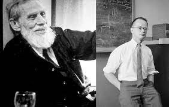
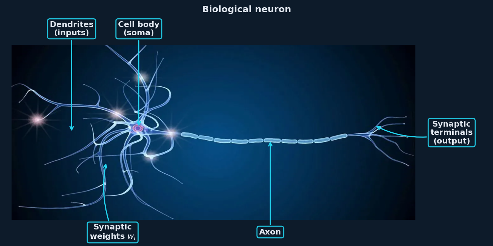
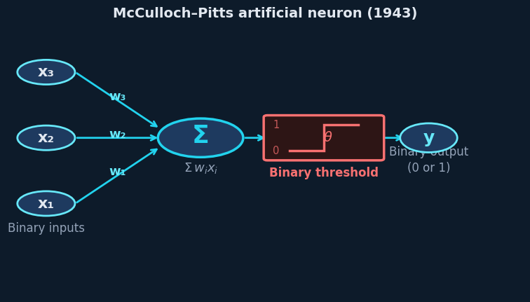
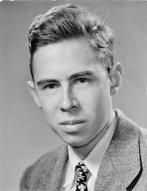
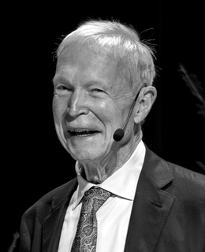
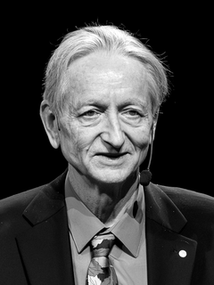

---
format:
  revealjs:
    theme: [default, custom.scss]
    slide-number: c/t
    show-slide-number: all
    hash: true
    controls: true
    progress: true
    transition: slide
    background-transition: fade
    highlight-style: github-dark
    code-line-numbers: false
    width: 1280
    height: 720
    margin: 0.05
    center: false
    footer: "CAS 2026 · Jurmala · AI for Medical Accelerators — Accelerator Side · A. Ghribi"
    chalkboard:
      theme: whiteboard
      boardmarker-width: 3
      chalk-width: 3
    mouse-wheel: false
    include-after-body: _afterbody.html
execute:
  echo: true
  eval: false
  warning: false
  message: false
---

```{python}
#| echo: false
#| eval: true
import plotly.io as pio
pio.renderers.default = 'notebook'
```

## {.title-slide background-color="#0d1b2a"}

::: {style="margin-top: 2em;"}
**AI Applications for Medical Accelerators**

::: {style="color: #22d3ee; font-size: 1.3em; font-weight: 700; margin: 0.4em 0;"}
Accelerator Side
:::

CAS Topical Course on Medical Accelerators · Jurmala, Latvia · June 2026

::: {style="color: #94a3b8; font-size: 0.8em; margin-top: 2em;"}
Dr. Adnan Ghribi — GANIL / CNRS-IN2P3  ·  `adnan.ghribi@ganil.fr`
:::
:::

::: notes
Welcome. This lecture covers AI applied to the machine — the accelerator — not the patient. 3 use cases with live notebooks, 10 min of context first. Q&A at the end.
:::

---

## Lecture outline

::: {.col-left}

| Time | Section |
|-----:|---------|
| 0–3 min | Scope & context |
| 3–12 min | A brief history of AI |
| 12–24 min | **Use case 1** — RF fault detection |
| 24–35 min | **Use case 2** — Beam tuning |
| 35–47 min | **Use case 3** — Surrogate models |
| 47–50 min | Digital twins & open problems |
| 50–60 min | Q&A |

::: {style="margin-top: 0.6em; font-size: 0.75em; color: #94a3b8; line-height: 1.8;"}
<a href="https://github.com/aghribi/cas2026-ai-medical-accelerators" style="color:#94a3b8;"><svg class="gh-icon" xmlns="http://www.w3.org/2000/svg" viewBox="0 0 16 16"><path d="M8 0C3.58 0 0 3.58 0 8c0 3.54 2.29 6.53 5.47 7.59.4.07.55-.17.55-.38 0-.19-.01-.82-.01-1.49-2.01.37-2.53-.49-2.69-.94-.09-.23-.48-.94-.82-1.13-.28-.15-.68-.52-.01-.53.63-.01 1.08.58 1.23.82.72 1.21 1.87.87 2.33.66.07-.52.28-.87.51-1.07-1.78-.2-3.64-.89-3.64-3.95 0-.87.31-1.59.82-2.15-.08-.2-.36-1.02.08-2.12 0 0 .67-.21 2.2.82.64-.18 1.32-.27 2-.27.68 0 1.36.09 2 .27 1.53-1.04 2.2-.82 2.2-.82.44 1.1.16 1.92.08 2.12.51.56.82 1.27.82 2.15 0 3.07-1.87 3.75-3.65 3.95.29.25.54.73.54 1.48 0 1.07-.01 1.93-.01 2.2 0 .21.15.46.55.38A8.013 8.013 0 0016 8c0-4.42-3.58-8-8-8z"/></svg>aghribi/cas2026-ai-medical-accelerators</a>
AccML review: [aghribi.github.io/acc-ml-living-review](https://aghribi.github.io/acc-ml-living-review)
:::

:::

::: {.col-right style="padding-top: 0.3em;"}

::: {.highlight-box}
**Three companion notebooks** — open on Colab now:

- `01_fault_detection` — autoencoder on RF waveforms
- `02_beam_tuning` — Bayesian optimisation with Cheetah
- `03_surrogate_model` — MLP surrogate + ensemble UQ
:::

:::

::: {.clearfix}
:::

::: notes
Three live notebooks. The code you will see on the slides is the code in those notebooks. Everything is runnable on Google Colab from your phone right now — no installation needed.
:::

---

## What this lecture covers

::: {.col-left}
**In scope — the accelerator side**

- RF fault detection
- Beam tuning & daily startup
- Surrogate models for beam physics
- Digital twins
:::

::: {.col-right}
**Out of scope today**

- Treatment planning
- Patient-facing clinical AI
- Radiobiology
- Regulatory certification
:::

::: {.clearfix}
:::

::: {.key-result style="margin-top: 1em;"}
The beam that treats the patient must be produced by a machine that works.
AI can keep that machine reliable, efficient, and well-characterised.
:::

---

## What changes for AI in a medical machine

| | Research machine | Clinical machine |
|---|---|---|
| **Downtime** | Hours–days acceptable | Patients cannot be rescheduled |
| **Fault data** | Abundant — machine is pushed hard | **Scarce by design** |
| **Regulatory** | Internal rules | IEC 62304, FDA/CE, EU AI Act |

::: {.warning-box style="margin-top: 1em;"}
**The key inversion:** clinical machines are engineered to *avoid* faults — so fault data is scarce.
Unsupervised, sample-efficient, and physics-informed approaches are not just preferences — they are requirements.
:::

# A Brief History of AI {.section-divider background-color="#0a1520"}

::: {style="color: #22d3ee; font-size: 1.2em; margin-top: 0.6em;"}
From the first neuron to the Nobel Prize in Physics
:::

```{python}
#| echo: false
#| eval: true

import plotly.graph_objects as go

events = [
    (1943, "McCulloch-Pitts<br>neuron", 1, "#475569"),
    (1957, "Rosenblatt<br>Perceptron", -1, "#22d3ee"),
    (1969, "Minsky-Papert<br>(XOR limit)", 1, "#f87171"),
    (1982, "Hopfield<br>networks", -1, "#22d3ee"),
    (1986, "Backprop<br>(Rumelhart)", 1, "#22d3ee"),
    (1998, "LeNet<br>(LeCun)", -1, "#a78bfa"),
    (2006, "Deep belief<br>nets (Hinton)", 1, "#a78bfa"),
    (2012, "AlexNet<br>(ImageNet)", -1, "#fb923c"),
    (2017, "Transformers<br>(Attention)", 1, "#fb923c"),
    (2022, "ChatGPT", -1, "#f87171"),
    (2024, "Nobel Prize<br>Physics", 1, "#fbbf24"),
]

fig = go.Figure()
fig.add_shape(type="line", x0=1938, x1=2026, y0=0, y1=0,
    line=dict(color="#22d3ee", width=2.5))

for year, label, side, color in events:
    y_end = 0.52 * side
    fig.add_shape(type="line", x0=year, x1=year, y0=0, y1=y_end * 0.82,
        line=dict(color=color, width=1.5, dash="dot"))
    fig.add_trace(go.Scatter(x=[year], y=[0], mode="markers",
        marker=dict(color=color, size=11, line=dict(color="#0d1b2a", width=2)),
        showlegend=False, hovertext=f"{year}: {label}"))
    fig.add_annotation(x=year, y=y_end,
        text=f"<b>{year}</b><br><span style='font-size:10px'>{label}</span>",
        showarrow=False, font=dict(size=11, color=color), align="center")

fig.update_layout(
    height=380, autosize=True, paper_bgcolor="#0d1b2a", plot_bgcolor="#0d1b2a",
    margin=dict(l=10, r=10, t=10, b=10),
    xaxis=dict(showgrid=False, showticklabels=False, zeroline=False, range=[1936, 2027]),
    yaxis=dict(showgrid=False, showticklabels=False, zeroline=False, range=[-0.9, 0.9]),
    font=dict(color="#e2e8f0"),
)
fig
```

::: notes
The yellow dot at 2024 is the Nobel Prize in Physics awarded to Hopfield and Hinton — formally recognising that the foundations of modern AI are physics.

Note the two "winters" (after 1969 and after the late 1980s) — periods when funding and interest collapsed because the field overpromised. The current period since AlexNet in 2012 has been the longest sustained growth in AI history.
:::

---

## McCulloch & Pitts — the first artificial neuron (1943)

<div style="position:absolute; top:0.2em; right:0.4em; z-index:10;">

</div>

:::: {.columns style="margin-top:0.2em;"}

::: {.column width="42%"}

**Warren McCulloch** & **Walter Pitts** — first mathematical model of a neuron, mapping neural firing onto Boolean logic (1943).

::: {style="font-size:0.76em; margin:0.4em 0; line-height:1.6;"}
**How a neuron works:**

- **Dendrites** collect incoming signals from neighbouring neurons
- **Soma** (cell body) integrates them as a weighted sum $\sum w_i x_i$
- A neuron **fires** if the sum exceeds a threshold θ, then sends the output down the **axon** to the next neurons
:::

:::

::: {.column width="56%"}





:::

::::

::: {.slide-ref}
McCulloch & Pitts (1943). A logical calculus of the ideas immanent in nervous activity. *Bull. Math. Biophysics* 5, 115–133.
:::

---

## The perceptron — first learning algorithm (1957)

::: {.col-left}



**Frank Rosenblatt, 1957** — the Perceptron:

$$y = \text{sign}\!\left(\sum_i w_i x_i - \theta\right)$$

A single neuron that learns from examples by adjusting weights.
Inspired by McCulloch-Pitts neurons (1943) and Hebbian learning.

:::

::: {.col-right}

::: {.highlight-box}
**The perceptron learning rule:**

$$w_i \leftarrow w_i + \eta \cdot (y - \hat{y}) \cdot x_i$$

Every modern network still follows this principle.
:::

::: {.key-result style="margin-top: 0.8em;"}
Rosenblatt's Mark 1 Perceptron (1958) was a physical hardware device — it made the front page of the New York Times.
:::

:::

::: {.clearfix}
:::

::: {.slide-ref}
Rosenblatt, F. (1958). The perceptron: a probabilistic model for information storage and organization in the brain. *Psychol. Rev.* 65(6), 386–408.
:::

::: notes
The Mark 1 Perceptron at Cornell learned to recognise patterns from photographs. The core idea — adjustable weighted connections that learn from examples — is the conceptual ancestor of modern deep networks, though the perceptron update rule (a discrete correction on misclassification) is historically and mathematically distinct from backpropagation.
:::

---

## AI winters and the deep learning renaissance

::: {.col-left}

::: {.highlight-box}
**1969 — Minsky & Papert**

Proved the perceptron cannot solve XOR.
Neural networks enter a decade-long *first winter*.
:::

::: {.highlight-box style="margin-top: 0.6em;"}
**1986 — Rumelhart, Hinton, Williams**

Backpropagation: multi-layer networks can learn any function.
Second spring — then a second winter in the 1990s.
:::

:::

::: {.col-right}

::: {.key-result}
**2012 — AlexNet** wins ImageNet by 10 percentage points.

The current era of deep learning begins.
:::

::: {.key-result style="margin-top: 0.8em;"}
From a single neuron in 1957 to GPT-4 in 2023 — the same mathematical idea, scaled and stacked.
:::

:::

::: {.clearfix}
:::

::: notes
The Minsky-Papert result was a setback, but the real fix was the sigmoid activation function — a smooth, differentiable non-linearity that replaced the binary threshold. With a differentiable activation, gradients can flow back through multiple layers, making backpropagation tractable. A step function has zero gradient almost everywhere; you cannot train through it.
:::

---

## Physics at the core of AI

<div style="position:absolute; top:0.2em; right:0.4em; z-index:10; display:flex; gap:0.7em;">
<figure style="display:flex; flex-direction:row; align-items:center; gap:0.3em; margin:0;">
<figcaption style="font-size:0.55em; color:#94a3b8; text-align:right; white-space:nowrap;">J. Hopfield</figcaption>

</figure>
<figure style="display:flex; flex-direction:row; align-items:center; gap:0.3em; margin:0;">
<figcaption style="font-size:0.55em; color:#94a3b8; text-align:right; white-space:nowrap;">G. Hinton</figcaption>

</figure>
</div>

::: {.col-left}

**John Hopfield, 1982** — stores memories as energy minima of the Ising Hamiltonian:

$$E = -\frac{1}{2} \sum_{ij} w_{ij} s_i s_j$$

**Geoffrey Hinton** extended this with the Boltzmann distribution $P(s) \propto e^{-E/T}$ — giving neural networks a thermodynamic learning rule.

:::

::: {.col-right}

::: {.highlight-box style="margin-top:2.5em;"}
**Nobel Prize in Physics 2024**

*"for foundational discoveries enabling machine learning with artificial neural networks"*

— **John J. Hopfield** & **Geoffrey E. Hinton**

Awarded in **Physics**, not Computer Science.
:::

:::

::: {.clearfix}
:::

::: notes
The Nobel Committee's citation is explicit: Hopfield's use of statistical mechanics to build associative memory, and Hinton's extension to probabilistic models using the Boltzmann distribution, are the foundations.

As accelerator physicists, we think in terms of Hamiltonians, phase spaces, and energy minimisation every day. ML is a natural extension of our toolkit.
:::

---

## Hopfield networks — neurons as spins

:::: {.columns style="margin-top:0.2em;"}
::: {.column width="50%"}

The same mathematics describes **Ising spins** and **neural networks**:

::: {style="font-size:0.82em; line-height:1.5;"}
| Ising model | Hopfield network |
|:---|:---|
| Spin $s_i \in \{-1,+1\}$ | Neuron state |
| Coupling $J_{ij}$ | Synaptic weight $w_{ij}$ |
| $E = -\tfrac{1}{2}\sum J_{ij}s_is_j$ | Same Hamiltonian |
| Ground state | Stored memory |
:::

::: {style="margin-top:0.5em; font-size:0.84em;"}
**Hebbian learning** — to store pattern $\xi^\mu$:
$$w_{ij} = \frac{1}{N}\sum_\mu \xi_i^\mu \xi_j^\mu$$
:::

:::
::: {.column width="48%"}

```{python}
#| echo: false
#| eval: true

import numpy as np
import plotly.graph_objects as go
from plotly.subplots import make_subplots

np.random.seed(7)
N = 10
p = -np.ones((N, N))
p[:, 1] = 1; p[:, 8] = 1       # vertical bars of "H"
p[4:6, 1:9] = 1                 # crossbar

noisy = p.copy()
noisy[np.random.rand(N, N) < 0.28] *= -1

fig = make_subplots(rows=1, cols=2,
    subplot_titles=["Stored memory ξ", "Noisy input (28 % flipped)"],
    horizontal_spacing=0.10)
cscale = [[0, "#f87171"], [0.5, "#0d1b2a"], [1, "#22d3ee"]]
for col, grid in enumerate([p, noisy], 1):
    fig.add_trace(go.Heatmap(
        z=grid, zmin=-1, zmax=1, colorscale=cscale, showscale=False,
    ), row=1, col=col)
    fig.update_xaxes(showticklabels=False, showgrid=False, zeroline=False, row=1, col=col)
    fig.update_yaxes(showticklabels=False, showgrid=False, zeroline=False, row=1, col=col)
fig.update_layout(
    height=310, autosize=True,
    paper_bgcolor="#0d1b2a", plot_bgcolor="#0d1b2a",
    font=dict(color="#e2e8f0", size=11),
    margin=dict(l=5, r=5, t=28, b=5),
)
fig
```

::: {style="font-size:0.70em; color:#94a3b8; text-align:center; margin-top:0.15em;"}
Red = −1 (spin ↓) · Cyan = +1 (spin ↑)
:::

:::
::::

::: {.slide-ref}
Hopfield, J.J. (1982). Neural networks and physical systems with emergent collective computational abilities. *PNAS* 79, 2554–2558.
:::

::: notes
The Ising model from the 1920s describes ferromagnetism. Hopfield's 1982 insight: the same mathematics describes associative memory — neurons are spins, synaptic weights are couplings, memories are energy minima. This is exact, not analogical.
:::

---

## Hopfield — memory retrieval and capacity

:::: {.columns style="margin-top:0.2em;"}
::: {.column width="54%"}

```{python}
#| echo: false
#| eval: true

import numpy as np
import plotly.graph_objects as go

x = np.linspace(-2.5, 2.5, 90)
y = np.linspace(-2.5, 2.5, 90)
X, Y = np.meshgrid(x, y)

E = (
    - 2.2 * np.exp(-2.2*((X - 1.3)**2 + (Y - 1.1)**2))
    - 2.2 * np.exp(-2.2*((X + 1.3)**2 + (Y + 1.1)**2))
    + 0.28*(X**2 + Y**2)
)

fig = go.Figure()
fig.add_trace(go.Contour(
    z=E, x=x, y=y,
    colorscale=[[0,"#0a2040"],[0.4,"#1a3a6f"],[0.75,"#22d3ee"],[1,"#f87171"]],
    contours=dict(showlabels=False, coloring='fill'),
    showscale=False, ncontours=22, opacity=0.9,
))
fig.add_trace(go.Scatter(
    x=[1.3, -1.3], y=[1.1, -1.1], mode="markers+text",
    marker=dict(color="#fbbf24", size=14, symbol="star"),
    text=["Memory 1", "Memory 2"],
    textposition=["top right", "bottom left"],
    textfont=dict(size=10, color="#fbbf24"),
    showlegend=False,
))
tx = [0.35, 0.60, 0.88, 1.10, 1.25, 1.30]
ty = [0.05, 0.30, 0.62, 0.88, 1.03, 1.10]
fig.add_trace(go.Scatter(
    x=tx, y=ty, mode="lines+markers",
    line=dict(color="#fb923c", width=2.5),
    marker=dict(color="#fb923c", size=7),
    showlegend=False,
))
fig.add_annotation(x=0.35, y=0.05, text="Noisy cue",
    font=dict(size=9, color="#fb923c"),
    showarrow=True, ax=-40, ay=25,
    arrowcolor="#fb923c", arrowwidth=1.5)
fig.update_layout(
    height=330, autosize=True,
    paper_bgcolor="#0d1b2a", plot_bgcolor="#0d1b2a",
    xaxis=dict(showgrid=False, showticklabels=False, zeroline=False),
    yaxis=dict(showgrid=False, showticklabels=False, zeroline=False),
    margin=dict(l=5, r=5, t=22, b=5),
    font=dict(color="#e2e8f0"),
    title=dict(text="Energy landscape E(s)",
               font=dict(size=11, color="#94a3b8"), x=0.5, y=0.99),
)
fig
```

:::
::: {.column width="44%"}

::: {.highlight-box style="margin-bottom:0.5em; font-size:0.76em;"}
**Retrieval = descend in energy**

Updates spins one-by-one:
$s_i \leftarrow \text{sign}(\sum_j w_{ij} s_j)$
— always converging to the nearest stored memory.
:::

::: {.key-result .fragment style="font-size:0.76em;"}
**Capacity ≈ 0.14 N patterns**

For N neurons, up to ~0.14N patterns stored reliably.
Derived by **replica method** (stat. mech.) — not a CS result.
:::

:::
::::

::: {.slide-ref}
Amit, Gutfreund & Sompolinsky (1985). Storing infinite numbers of patterns in a spin-glass model. *PRL* 55, 1530.
:::

::: notes
The capacity limit 0.14N is a phase-transition result: beyond this, retrieval fails catastrophically. This uses the replica trick from spin-glass theory — Amit, Gutfreund and Sompolinsky 1985. It is pure statistical mechanics applied to neural networks.
:::

---

## Statistical mechanics → deep learning

::: {style="margin-top:0.15em; font-size:0.72em;"}

| Physics concept | ML analogue |
|:---|:---|
| **Hamiltonian / energy** $H(s)$ | **Loss function** $\mathcal{L}(\theta)$ |
| **Partition function** $Z = \sum_s e^{-H/T}$ | Normalisation constant (softmax, VAE) |
| **Temperature** $T$ | Learning rate / annealing schedule |
| **Boltzmann distribution** $P \propto e^{-E/T}$ | Softmax output — Boltzmann machine |
| **Phase transition** | Grokking (sharp generalisation threshold) |
| **Langevin dynamics** $\dot{x} = -\nabla E + \eta$ | **Stochastic gradient descent (SGD)** |
| **Free energy** $F = -T\ln Z$ | ELBO / variational lower bound (VAE) |

:::

::: {.key-result style="margin-top:0.4em; font-size:0.82em;"}
Not metaphors — the **same mathematics**, rediscovered independently.
As accelerator physicists we already speak this language.
:::

::: notes
The connection between SGD and Langevin dynamics was formalised by Welling & Teh (2011). The Boltzmann machine (Ackley, Hinton & Sejnowski 1985) is a literal physical model. Phase transitions in learning (grokking) are an active research topic since Power et al. (2022). These connections mean accelerator physicists are naturally equipped to understand ML at a deep level — the toolkit is the same.
:::

# Practical Foundations {.section-divider background-color="#0a1520"}

::: {style="color: #22d3ee; font-size: 1.6em; font-weight: 800; margin-top: 0.5em;"}
From raw signals to trained model
:::

::: {style="font-size: 1em; color: #94a3b8;"}
Data · Features · Method selection · Pipeline
:::

---

## Data quality — garbage in, garbage out

::: {style="display:flex; gap:0.35em; margin:0.15em 0 0.4em 0;"}
::: {.highlight-box style="flex:1; padding:0.35em 0.55em; font-size:0.80em; margin:0;"}
**① Clean**

Remove corrupted pulses, stuck sensors, dropouts
:::
::: {.highlight-box style="flex:1; padding:0.35em 0.55em; font-size:0.80em; margin:0;"}
**② Synchronise**

Align timestamps across RF, BPM, power supplies
:::
::: {.highlight-box style="flex:1; padding:0.35em 0.55em; font-size:0.80em; margin:0;"}
**③ Normalise**

Scale to [−1, 1]; prevents one channel dominating
:::
::: {.highlight-box style="flex:1; padding:0.35em 0.55em; font-size:0.80em; margin:0;"}
**④ Balance**

SRF faults < 0.1 % of pulses; naïve model learns to ignore them
:::
:::

```{python}
#| echo: false
#| eval: true

import numpy as np
import plotly.graph_objects as go
from plotly.subplots import make_subplots

np.random.seed(42)
t = np.linspace(0, 4*np.pi, 300)
raw = np.sin(t) + 0.25 * np.random.randn(300)
raw[55] = 3.9
raw[195] = -3.6

# Min-max scale to exactly [−1, 1]
clean_raw = np.sin(t) + 0.1 * np.random.randn(300)
mn, mx = clean_raw.min(), clean_raw.max()
cleaned = 2.0 * (clean_raw - mn) / (mx - mn) - 1.0

fig = make_subplots(
    rows=1, cols=2,
    subplot_titles=["Raw signal — noise & outliers",
                    "After cleaning & normalisation  [−1, 1]"],
    horizontal_spacing=0.10,
)

fig.add_trace(go.Scatter(
    x=t, y=raw, mode='lines',
    line=dict(color='#64748b', width=1.2), showlegend=False,
), row=1, col=1)
fig.add_trace(go.Scatter(
    x=[t[55], t[195]], y=[raw[55], raw[195]], mode='markers',
    marker=dict(color='#f87171', size=13, symbol='x',
                line=dict(width=2.5, color='#f87171')),
    showlegend=False,
), row=1, col=1)
fig.add_annotation(x=t[55], y=raw[55]+0.25, text="outlier",
    showarrow=False, font=dict(size=9, color='#f87171'), row=1, col=1)

fig.add_trace(go.Scatter(
    x=t, y=cleaned, mode='lines',
    line=dict(color='#22d3ee', width=1.4), showlegend=False,
), row=1, col=2)
fig.add_hline(y=1,  line_dash="dot", line_color="#475569", opacity=0.6, row=1, col=2)
fig.add_hline(y=-1, line_dash="dot", line_color="#475569", opacity=0.6, row=1, col=2)

fig.update_xaxes(showgrid=False, showticklabels=False, zeroline=False)
fig.update_yaxes(showgrid=True, gridcolor='#1e3048', zeroline=True,
                 zerolinecolor='#334155')
fig.update_yaxes(range=[-1.15, 1.15], row=1, col=2)

fig.update_layout(
    height=360, autosize=True,
    paper_bgcolor='#0d1b2a', plot_bgcolor='#111f30',
    font=dict(color='#e2e8f0', size=11),
    margin=dict(t=28, b=5, l=10, r=10),
)
fig
```

<div class="fragment slide-callout-overlay">
<div class="callout-box">
A model trained on bad data learns bad behaviour.<br>
<span style="font-weight:400; font-size:0.82em; color:#94a3b8;">No algorithm compensates for this.</span>
</div>
</div>

---

## Feature engineering — from 1 024 numbers to 3

```{python}
#| echo: false
#| eval: true

import numpy as np
import plotly.graph_objects as go
from plotly.subplots import make_subplots

np.random.seed(7)
n = 256
t = np.linspace(0, 1, n) * 1000  # ms

# Simulated SRF cavity IQ: flat-top pulse with ramps
A = np.zeros(n)
A[30:220] = 1.0
A[30:60]  = np.linspace(0, 1, 30)
A[195:220] = np.linspace(1, 0, 25)
A += 0.03 * np.random.randn(n)

phase_drift = np.zeros(n)
phase_drift[30:220] = np.cumsum(0.003 * np.random.randn(190))
I = A * np.cos(phase_drift)
Q = A * np.sin(phase_drift)

mean_amp   = float(np.mean(A[30:220]))
phase_std  = float(np.std(phase_drift[30:220]) * 180 / np.pi)
fill_frac  = float(np.sum(A > 0.5) / n)

fig = make_subplots(
    rows=1, cols=2,
    subplot_titles=[
        "Raw IQ waveform — 256 samples / pulse",
        "Extracted features — 3 scalars",
    ],
    column_widths=[0.62, 0.38],
)

fig.add_trace(go.Scatter(x=t, y=I, mode='lines',
    line=dict(color='#60a5fa', width=1.2), name='I'), row=1, col=1)
fig.add_trace(go.Scatter(x=t, y=Q, mode='lines',
    line=dict(color='#a78bfa', width=1.2), name='Q'), row=1, col=1)
fig.add_trace(go.Scatter(x=t, y=A, mode='lines',
    line=dict(color='#22d3ee', width=2.2), name='|A| amplitude'), row=1, col=1)

fig.add_trace(go.Bar(
    x=['Mean<br>amplitude', 'Phase drift<br>(deg)', 'Fill<br>fraction'],
    y=[mean_amp, phase_std, fill_frac],
    marker_color=['#22d3ee', '#f87171', '#fb923c'],
    text=[f'{mean_amp:.3f}', f'{phase_std:.2f}°', f'{fill_frac:.2f}'],
    textposition='outside',
    textfont=dict(color='#e2e8f0', size=13),
    showlegend=False,
), row=1, col=2)


fig.update_xaxes(showgrid=True, gridcolor='#1e3048', zeroline=False,
    title_text="Time (ms)", row=1, col=1)
fig.update_yaxes(showgrid=True, gridcolor='#1e3048', zeroline=False, row=1, col=1)
fig.update_xaxes(showgrid=False, row=1, col=2)
fig.update_yaxes(showgrid=True, gridcolor='#1e3048', zeroline=False,
    range=[0, max(mean_amp, phase_std, fill_frac)*1.4], row=1, col=2)

fig.update_layout(
    height=390, autosize=True,
    paper_bgcolor='#0d1b2a', plot_bgcolor='#111f30',
    font=dict(color='#e2e8f0', size=11),
    legend=dict(bgcolor='rgba(0,0,0,0)', font=dict(size=10), x=0.02, y=0.96),
    margin=dict(t=28, b=8, l=10, r=10),
)
fig
```

::: {style="font-size:0.68em; color:#22d3ee; font-weight:600; text-align:center; margin:0.15em 0 0 0;"}
256 numbers → 3 numbers · 99 % compression, all information retained
:::

<div class="fragment slide-callout-overlay">
<div class="callout-box">
Good features = simpler models + better generalisation.<br>
<span style="font-weight:400; font-size:0.82em; color:#94a3b8;">Domain knowledge beats brute force.</span>
</div>
</div>

---

## Choosing the right method

```{python}
#| echo: false
#| eval: true

import plotly.graph_objects as go

# x: training data / evaluations needed (0 = very few → 3 = large dataset)
# y: works without fault labels (1 = needs full labels → 5 = fully unsupervised)
methods = [
    ("Threshold rules",      0.05, 4.3, 22, "#475569", "top right"),
    ("PCA / statistics",     0.30, 3.8, 22, "#64748b", "bottom right"),
    ("Isolation Forest",     0.65, 3.4, 24, "#94a3b8", "bottom right"),
    ("RL (online)",          0.90, 3.1, 26, "#fb923c", "top right"),
    ("Bayesian Opt ★",       0.40, 4.1, 44, "#22d3ee", "bottom left"),
    ("Autoencoder ★",        1.25, 4.6, 44, "#22d3ee", "top left"),
    ("GP Surrogate",         1.70, 2.6, 26, "#60a5fa", "bottom right"),
    ("SVM (supervised)",     1.35, 1.0, 24, "#94a3b8", "bottom right"),
    ("MLP Surrogate ★",      2.45, 1.8, 44, "#22d3ee", "top right"),
    ("Deep CNN / LSTM",      2.80, 1.2, 28, "#a78bfa", "bottom right"),
    ("Transformer / LLM",    3.10, 0.7, 26, "#a78bfa", "top left"),
]

fig = go.Figure()

fig.add_shape(type="rect", x0=-0.15, x1=1.65, y0=2.7, y1=5.2,
    fillcolor="rgba(34,211,238,0.04)", layer="below",
    line=dict(color="rgba(34,211,238,0.25)", width=1, dash="dot"))
fig.add_annotation(x=0.75, y=5.05, text="<i>clinical-machine zone</i>",
    showarrow=False, font=dict(size=10, color="#22d3ee"), opacity=0.6)

for name, x, y, size, color, pos in methods:
    is_pick = "★" in name
    fig.add_trace(go.Scatter(
        x=[x], y=[y], mode="markers+text",
        marker=dict(size=size, color=color,
            line=dict(color="#e2e8f0" if is_pick else "#0d1b2a",
                      width=2.5 if is_pick else 1.5)),
        text=[f"<b>{name}</b>" if is_pick else name],
        textposition=pos,
        textfont=dict(size=13 if is_pick else 10, color=color),
        showlegend=False,
    ))

fig.update_layout(
    height=490, autosize=True,
    paper_bgcolor="#0d1b2a", plot_bgcolor="#111f30",
    font=dict(color="#e2e8f0", size=11),
    xaxis=dict(
        title="Training data / evaluations needed",
        range=[-0.3, 3.5],
        tickvals=[0.3, 1.5, 2.7],
        ticktext=["Very few  (< 100)", "Moderate  (1 000s)", "Large  (> 10 000s)"],
        showgrid=True, gridcolor="#1e3048", zeroline=False,
    ),
    yaxis=dict(
        title="Works without fault labels",
        range=[0.3, 5.4],
        tickvals=[1, 2, 3, 4, 5],
        ticktext=["Needs full<br>label set", "Needs partial<br>labels",
                  "Semi-super-<br>vised", "Mostly<br>label-free", "Fully<br>unsupervised"],
        showgrid=True, gridcolor="#1e3048", zeroline=False,
    ),
    margin=dict(l=110, r=30, t=15, b=70),
)
fig
```

::: {.slide-ref}
★ methods used in this lecture. Existing detail landscapes: anomaly detection → slide 14 · optimisation → slide 21 · surrogate → slide 27
:::

---

## The ML pipeline — from data to inference

```{python}
#| echo: false
#| eval: true

import plotly.graph_objects as go

stages = [
    ("Raw\nData",      "#475569", "Waveforms\nimages, logs\nset-points"),
    ("Pre-\nprocess",  "#3b82f6", "Clean · sync\nnormalise\nresample"),
    ("Feature\nextract","#6366f1", "FFT · Gaussian\nfit · statistics\ndomain stats"),
    ("Train &\nvalidate","#a78bfa","80/20 split\ncross-val\nloss / AUC"),
    ("Deploy\n& infer", "#22d3ee", "Sub-ms resp.\nmonitoring\nretraining"),
]

fig = go.Figure()

bw, bh = 1.35, 0.72
dx = 1.80

for i, (label, color, sub) in enumerate(stages):
    x0 = i * dx
    xm = x0 + bw / 2
    fig.add_shape(type="rect", x0=x0, x1=x0+bw, y0=-bh/2, y1=bh/2,
        fillcolor=color, opacity=0.15, line=dict(color=color, width=2))
    fig.add_annotation(x=xm, y=0.10, text=f"<b>{label}</b>",
        showarrow=False, font=dict(size=13, color=color), align='center')
    fig.add_annotation(x=xm, y=-0.24,
        text=f"<span style='font-size:9px;color:#94a3b8;'>{sub}</span>",
        showarrow=False, align='center')
    if i < len(stages) - 1:
        xa = x0 + bw + 0.02
        xb = x0 + dx - 0.02
        fig.add_annotation(x=xb, y=0, ax=xa, ay=0,
            xref='x', yref='y', axref='x', ayref='y',
            arrowhead=2, arrowsize=1.2, arrowwidth=2,
            arrowcolor='rgba(34,211,238,0.6)', showarrow=True, text='')

uc_data = [
    ("#22d3ee", "UC1 · Fault detection",
     "IQ waveforms → amplitude / phase\n→ autoencoder → reconstruction error → alarm"),
    ("#22d3ee", "UC2 · Beam tuning",
     "Quad settings → Cheetah sim\n→ BO acquisition → next proposal → evaluate"),
    ("#22d3ee", "UC3 · Surrogate",
     "5 000 Cheetah calls → normalise\n→ MLP (3-layer) → 586 × faster inference"),
]

n_uc = len(uc_data)
total_w = (len(stages) - 1) * dx + bw
uc_w = total_w / n_uc - 0.15
y_top = -bh/2 - 0.18

for k, (col, title, desc) in enumerate(uc_data):
    x0_uc = k * (uc_w + 0.15)
    xm_uc = x0_uc + uc_w / 2
    fig.add_shape(type="rect", x0=x0_uc, x1=x0_uc+uc_w,
        y0=y_top - 0.62, y1=y_top,
        fillcolor="rgba(34,211,238,0.06)", layer="below",
        line=dict(color="rgba(34,211,238,0.35)", width=1))
    fig.add_annotation(x=xm_uc, y=y_top - 0.10,
        text=f"<b style='color:#22d3ee;font-size:11px;'>{title}</b>",
        showarrow=False, align='center')
    fig.add_annotation(x=xm_uc, y=y_top - 0.36,
        text=f"<span style='font-size:9px;color:#94a3b8;'>{desc}</span>",
        showarrow=False, align='center')

fig.update_layout(
    height=490, autosize=True,
    paper_bgcolor='#0d1b2a', plot_bgcolor='#0d1b2a',
    xaxis=dict(showgrid=False, showticklabels=False, zeroline=False,
        range=[-0.25, (len(stages)-1)*dx + bw + 0.25]),
    yaxis=dict(showgrid=False, showticklabels=False, zeroline=False,
        range=[-1.2, 0.55]),
    margin=dict(t=10, b=5, l=5, r=5),
    showlegend=False,
    font=dict(color='#e2e8f0'),
)
fig
```

---

## AI arrives at accelerators

::: {style="font-size: 0.62em;"}

| Year | Facility | AI approach | Impact |
|------|----------|-------------|--------|
| 1993 | CERN LEP | Neural network orbit correction | First ML system in live operation |
| 2006–2012 | SLAC, DESY | SVMs, shallow networks — exploratory | Proof-of-concept studies, no production |
| 2016 | Community | Edelen survey — 50+ ML papers reviewed | Revival of interest across labs |
| 2018 | SLAC LCLS | Bayesian optimisation (BO) in production | −10% beam loss, ~50 machine evaluations |
| 2019 | JLab CEBAF | Autoencoder on SRF IQ waveforms | Cavity fault detection — no fault labels needed |
| 2021 | SLAC LCLS-II | Cheetah differentiable beam simulator | 10³–10⁵× faster than tracking codes |
| 2022 | ESRF, SNS | Reinforcement learning for orbit/tune | Autonomous closed-loop beam control |
| 2024 | KIT KARA | Anomaly detection + AI energy management | **−30% energy footprint** on real storage ring |
| 2026 | 19 institutions | TwinRISE digital twin programme | Production digital twins for proton therapy |

:::

::: {.slide-ref}
Edelen et al., *IEEE TNS* 63 (2016) · Duris et al., *PRL* 124 (2020) · Kaiser et al., *PRAB* 27 (2024) · Ghribi et al., *EPN* 56 (2025)
:::

::: notes
30 years from first NNs to production AI systems. The key inflection point is 2019: BO in production at LCLS (Duris+2020), ML-based model-independent stabilisation at ALS (Leemann+2019, PRL 123:194801), differentiable simulation with Cheetah (Kaiser+2024, PRAB). KARA result is not a simulation — measured on the real machine.
:::

---

## {.no-footer background-iframe="https://aghribi.github.io/acc-ml-living-review" background-interactive="true"}

::: notes
This living review covers all ML applications in accelerator physics — updated continuously. It is the map of what has been done and what is open. Bookmark it.
:::

---

## Six ways AI helps accelerators today

::: {.fragment .fade-in}
::: {.highlight-box #box-fault style="margin: 0.35em 0; padding: 0.45em 0.9em; font-size:0.85em; line-height:1.6;"}
**Fault detection** — classify anomalous events before interlocks trigger
:::
:::
::: {.fragment .fade-in}
::: {.highlight-box #box-tuning style="margin: 0.35em 0; padding: 0.45em 0.9em; font-size:0.85em; line-height:1.6;"}
**Beam tuning** — find optimal settings with minimal beam time (< 50 evaluations)
:::
:::
::: {.fragment .fade-in}
::: {.highlight-box #box-surrogate style="margin: 0.35em 0; padding: 0.45em 0.9em; font-size:0.85em; line-height:1.6;"}
**Surrogate models** — replace slow tracking codes (10³–10⁵× speedup)
:::
:::
::: {.fragment .fade-in}
::: {.highlight-box style="margin: 0.35em 0; padding: 0.45em 0.9em; font-size:0.85em; line-height:1.6;"}
**Predictive maintenance** — forecast failures before they occur
:::
:::
::: {.fragment .fade-in}
::: {.highlight-box style="margin: 0.35em 0; padding: 0.45em 0.9em; font-size:0.85em; line-height:1.6;"}
**Adaptive control** — online reinforcement learning in the control loop
:::
:::
::: {.fragment .fade-in #lecture-focus-trigger}
::: {.highlight-box style="margin: 0.35em 0; padding: 0.45em 0.9em; font-size:0.85em; line-height:1.6;"}
**Digital twins** — live virtual model of the actual machine, continuously updated
:::
:::

::: notes
This lecture covers the first three in depth with runnable code.
:::

# Use Case 1 {.section-divider background-color="#0a1520"}

::: {style="color: #22d3ee; font-size: 1.6em; font-weight: 800; margin-top: 0.5em;"}
RF Fault Detection
:::

::: {style="font-size: 1em; color: #94a3b8;"}
Autoencoders on cavity IQ waveforms · Notebook 01
:::

---

## Anomaly detection — method landscape

```{python}
#| echo: false
#| eval: true

import plotly.graph_objects as go

# x: training data volume needed (0=minimal → 2=large dataset)
# y: suitability for rare-event / SRF fault detection (1=poor → 5=excellent)
methods = [
    ("Threshold rules",  0.00, 1.1, 20, "#475569", "bottom right"),
    ("PCA anomaly",      0.30, 2.0, 22, "#64748b", "top right"),
    ("KDE / GMM",        0.55, 2.3, 20, "#64748b", "bottom right"),
    ("Isolation Forest", 0.70, 2.9, 26, "#94a3b8", "top left"),
    ("One-class SVM",    0.90, 2.5, 24, "#94a3b8", "bottom right"),
    ("LSTM-AE",          1.60, 3.9, 26, "#a78bfa", "bottom right"),
    ("VAE",              1.80, 4.6, 30, "#a78bfa", "top right"),
    ("Autoencoder ★",   1.20, 4.3, 42, "#22d3ee", "top left"),
]

fig = go.Figure()
for name, x, y, size, color, pos in methods:
    is_pick = "★" in name
    fig.add_trace(go.Scatter(
        x=[x], y=[y], mode="markers+text",
        marker=dict(size=size, color=color,
            line=dict(color="#e2e8f0" if is_pick else "#0d1b2a",
                      width=2.5 if is_pick else 1.5)),
        text=[f"<b>{name}</b>" if is_pick else name],
        textposition=pos,
        textfont=dict(size=12 if is_pick else 10, color=color),
        showlegend=False,
    ))

fig.update_layout(
    height=530, autosize=True, paper_bgcolor="#0d1b2a", plot_bgcolor="#111f30",
    font=dict(color="#e2e8f0", size=11),
    xaxis=dict(title="Training data volume required",
               range=[-0.3, 2.5],
               tickvals=[0, 1, 2],
               ticktext=["Minimal<br>(unsupervised)", "Moderate<br>(normal data only)", "Large<br>(fault labels)"],
               showgrid=True, gridcolor="#1e3048", zeroline=False),
    yaxis=dict(title="Suitability for rare-event detection",
               range=[0.6, 5.4],
               tickvals=[1, 2, 3, 4, 5],
               ticktext=["Poor", "Fair", "Moderate", "Good", "Excellent"],
               showgrid=True, gridcolor="#1e3048", zeroline=False),
    margin=dict(l=90, r=30, t=20, b=70),
)
fig
```

::: {.key-result style="margin-top: 0.3em; font-size: 0.78em;"}
**This lecture:** Autoencoder — unsupervised, normal-data only, scales to 1 kHz waveform streams.
:::

---

## The problem: rare faults, no labels

::: {.col-left}

Every RF pulse → one **IQ waveform** per cavity at ~1 kHz.

- Clinical machines are **safe by design** → faults are rare
- Supervised classifiers need thousands of fault examples per class

::: {.fragment}
::: {.key-result style="margin-top: 0.6em;"}
**Solution:** autoencoder on normal pulses only.
Anomaly score = reconstruction error.
:::
:::

:::

::: {.col-right}

**Four fault classes in a superconducting cavity:**

- **Normal** — clean trapezoidal I, Q ≈ 0
- **Quench** — sudden drop mid flat-top
- **Detuning** — cavity off-resonance, large Q signal
- **Multipacting** — oscillations on the flat-top

::: {.fragment style="margin-top: 0.8em;"}
::: {.highlight-box}
No fault labels required for training.
:::
:::

:::

::: {.clearfix}
:::

---

## What the waveforms look like

```{python}
#| echo: false
#| eval: true

import numpy as np
import plotly.graph_objects as go
from plotly.subplots import make_subplots

def _env(t, rise=0.10, fall=0.85):
    return np.piecewise(t.astype(float),
        [t < rise, (t >= rise) & (t <= fall), t > fall],
        [lambda t: t/rise, 1.0, lambda t: (1-t)/(1-fall)])

t = np.linspace(0, 1, 256)
noise = 0.025

def normal(seed=0):
    rng = np.random.default_rng(seed)
    env = _env(t)
    return env + rng.normal(0, noise, 256), rng.normal(0, noise, 256)

def quench(seed=1):
    rng = np.random.default_rng(seed)
    I, Q = normal(seed); qp = rng.integers(80, 160)
    I[qp:] = rng.normal(0, noise/2, 256-qp)
    Q[qp:] = rng.normal(0, noise/2, 256-qp)
    return I, Q

def detuning(seed=2):
    rng = np.random.default_rng(seed)
    env = _env(t); freq = rng.uniform(3, 7)
    return (env*np.cos(2*np.pi*freq*t)+rng.normal(0,noise,256),
            env*np.sin(2*np.pi*freq*t)+rng.normal(0,noise,256))

def multipacting(seed=3):
    rng = np.random.default_rng(seed)
    I, Q = normal(seed); s, e = 40, 210
    freq = rng.uniform(6, 12); amp = rng.uniform(0.12, 0.22)
    tt = np.linspace(0, 1, e-s)
    I[s:e] += amp*np.sin(2*np.pi*freq*tt)
    Q[s:e] += amp*np.cos(2*np.pi*freq*tt)
    return I, Q

cases = [("Normal", normal, "#22d3ee"), ("Quench", quench, "#f87171"),
         ("Detuning", detuning, "#fb923c"), ("Multipacting", multipacting, "#a78bfa")]

fig = make_subplots(rows=2, cols=4,
    subplot_titles=[f"{n} — I" for n,_,_ in cases]+[f"{n} — Q" for n,_,_ in cases],
    vertical_spacing=0.12, horizontal_spacing=0.06)

for col, (name, fn, color) in enumerate(cases, 1):
    I, Q = fn()
    fig.add_trace(go.Scatter(x=t, y=I, line=dict(color=color, width=1.5),
        name=name, showlegend=(col==1)), row=1, col=col)
    fig.add_trace(go.Scatter(x=t, y=Q, line=dict(color=color, width=1.5),
        showlegend=False), row=2, col=col)

fig.update_layout(height=510, autosize=True, paper_bgcolor="#0d1b2a", plot_bgcolor="#111f30",
    font=dict(color="#e2e8f0", size=11), margin=dict(l=30, r=10, t=50, b=10),
    legend=dict(orientation="h", y=1.08, x=0.5, xanchor="center"))
fig.update_xaxes(showgrid=False, zeroline=False, color="#475569")
fig.update_yaxes(showgrid=True, gridcolor="#1e3048", zeroline=False, color="#475569")
fig
```

::: notes
Row 1 = I (in-phase), Row 2 = Q (quadrature). Normal: clean trapezoid, Q near zero. Detuning: strong Q. Quench: sharp drop. Multipacting: oscillations.
:::

---

## The autoencoder — architecture

::: {.col-left}

```{python}
class RFAutoencoder(nn.Module):
    def __init__(self, latent_dim=16):
        super().__init__()
        self.encoder = nn.Sequential(
            nn.Conv1d(2, 32, kernel_size=8, stride=4),
            nn.GELU(),
            nn.Conv1d(32, 64, kernel_size=4, stride=2),
            nn.GELU(),
            nn.Flatten(),
            nn.Linear(64 * 32, latent_dim),  # bottleneck
        )
        self.decoder = nn.Sequential(...)    # mirror
```

Input `(batch, 2, 256)` — I and Q as 2 channels

:::

::: {.col-right}

::: {.highlight-box}
**Why 1D convolutions?**

The waveform is a time series — Conv1d captures local temporal features (rise, drop, oscillations) efficiently.
:::

::: {.key-result style="margin-top: 0.8em;"}
**Anomaly score** = reconstruction error

Normal → low · Faults → high
:::

:::

::: {.clearfix}
:::

---

## Training and result

::: {.col-left}

```{python}
# Train on NORMAL pulses only
X_normal = X_train[y_train == 0]
for epoch in range(40):
    for (batch,) in loader:
        loss = ((batch - model(batch))**2).mean()
        optimizer.zero_grad()
        loss.backward()
        optimizer.step()

# Score every pulse at inference
with torch.no_grad():
    scores = ((X - model(X))**2).mean(dim=(1,2))
threshold = scores[normal_mask].quantile(0.95)
```

:::

::: {.col-right}

```{python}
#| echo: false
#| eval: true

import numpy as np
import plotly.graph_objects as go

np.random.seed(42)
normal_s = np.random.lognormal(-2.6, 0.4, 200)
fault_s  = np.random.lognormal(-0.7, 0.6, 600)
thresh   = np.percentile(normal_s, 95)

fig = go.Figure()
fig.add_trace(go.Histogram(x=normal_s, xbins=dict(start=0, end=0.55, size=0.009),
    name="Normal", marker_color="#22d3ee", opacity=0.75))
fig.add_trace(go.Histogram(x=fault_s.clip(max=0.55), xbins=dict(start=0, end=0.55, size=0.009),
    name="Faults", marker_color="#f87171", opacity=0.75))
fig.add_vline(x=thresh, line_dash="dash", line_color="#fbbf24", line_width=2.5,
    annotation_text="threshold (95th pct)", annotation_position="top right",
    annotation_font=dict(color="#fbbf24", size=12))
fig.update_layout(barmode="overlay", height=360, autosize=True,
    xaxis_title="Reconstruction error", yaxis_title="Count",
    paper_bgcolor="#0d1b2a", plot_bgcolor="#111f30",
    font=dict(color="#e2e8f0", size=11),
    legend=dict(bgcolor="rgba(0,0,0,0)"),
    margin=dict(l=40, r=10, t=10, b=40))
fig
```

::: {.key-result style="margin-top: 0.4em; font-size: 1.05em; text-align: center;"}
**ROC-AUC > 0.99**
:::

:::

::: {.clearfix}
:::

---

## Notebook 01 — live preview

<iframe src="notebooks_rendered/01_fault_detection.html"
        width="100%" height="610px" frameborder="0"
        style="border-radius:6px; border:1px solid #22d3ee; background:#fff;">
</iframe>

# Use Case 2 {.section-divider background-color="#0a1520"}

::: {style="color: #22d3ee; font-size: 1.6em; font-weight: 800; margin-top: 0.5em;"}
Beam Tuning with Bayesian Optimisation
:::

::: {style="font-size: 1em; color: #94a3b8;"}
Cheetah · differentiable accelerator simulation · Notebook 02
:::

---

## Optimisation — method landscape

```{python}
#| echo: false
#| eval: true

import plotly.graph_objects as go
import numpy as np

# x: log10(typical evaluations to converge) — lower = better
# y: works on real machine without gradient (1=no → 5=yes)
# Scope: static beam-tuning optimisation (not sequential online control)
methods = [
    ("Grid Search",          4.3, 4.6, 22, "#475569", "top left"),
    ("MOGA / GA",            3.6, 4.8, 24, "#a78bfa", "top right"),
    ("RL † online ctrl",     3.8, 5.0, 22, "#a78bfa", "bottom right"),
    ("Random Search",        2.5, 4.5, 24, "#94a3b8", "bottom right"),
    ("CMA-ES",               2.7, 4.7, 22, "#64748b", "top right"),
    ("Nelder-Mead",          2.3, 3.7, 22, "#94a3b8", "bottom left"),
    ("Gradient descent",     1.8, 1.4, 24, "#fb923c", "bottom right"),
    ("Bayesian Opt. ★",     1.6, 5.0, 42, "#22d3ee", "top right"),
]

fig = go.Figure()
for name, logx, y, size, color, pos in methods:
    is_pick = "★" in name
    fig.add_trace(go.Scatter(
        x=[logx], y=[y], mode="markers+text",
        marker=dict(size=size, color=color,
            line=dict(color="#e2e8f0" if is_pick else "#0d1b2a",
                      width=2.5 if is_pick else 1.5)),
        text=[f"<b>{name}</b>" if is_pick else name],
        textposition=pos,
        textfont=dict(size=12 if is_pick else 10, color=color),
        showlegend=False,
    ))

fig.add_annotation(x=1.6, y=4.35, text="← best quadrant",
    showarrow=False, font=dict(size=10, color="#fbbf24"), xanchor="left")
fig.add_annotation(x=4.95, y=0.85,
    text="† RL: best for sequential online control (not single-shot optimisation) — Emma+2018, Kain+2020",
    showarrow=False, font=dict(size=9, color="#64748b"), xanchor="right")

fig.update_layout(
    height=530, autosize=True, paper_bgcolor="#0d1b2a", plot_bgcolor="#111f30",
    font=dict(color="#e2e8f0", size=11),
    xaxis=dict(title="Evaluations to converge  (← fewer = better)",
               range=[1.0, 5.0],
               tickvals=[1, 2, 3, 4, 5],
               ticktext=["10", "100", "1 000", "10 000", "100 000"],
               showgrid=True, gridcolor="#1e3048", zeroline=False,
               autorange="reversed"),
    yaxis=dict(title="Real machine compatible (no gradient required)",
               range=[0.8, 5.5],
               tickvals=[1, 3, 5],
               ticktext=["No<br>(needs gradient)", "Partial", "Yes<br>(model-free)"],
               showgrid=True, gridcolor="#1e3048", zeroline=False),
    margin=dict(l=110, r=30, t=20, b=80),
)
fig
```

::: {.slide-ref}
Duris et al., *PRL* 124 (2020) · Frol et al., *IPAC* (2019)
:::

---

## The daily startup problem

::: {.col-left}

Every morning on a clinical machine:

1. Run QA checks (output, flatness, energy)
2. Tune magnets until beam is within spec
3. Hand off to clinical staff

Currently: **20–45 min of physicist time**, largely manual.

$n$ correctors × $k$ quads → high-dimensional space that grows exponentially for grid search.

:::

::: {.col-right}

::: {.highlight-box}
**Bayesian Optimisation fits naturally:**

- Works in 2–20 dimensions
- **~50 evaluations** to a good solution
- Model-free — no simulator needed
:::

::: {.key-result .fragment style="margin-top: 0.8em;"}
Demonstrated at AWAKE (CERN), FLASH (DESY), and clinical proton therapy centres.
:::

:::

::: {.clearfix}
:::

---

## Cheetah — PyTorch beam dynamics

::: {.col-left}

```{python}
import torch, cheetah

segment = cheetah.Segment(elements=[
    cheetah.Drift(length=torch.tensor(0.5)),
    cheetah.Quadrupole(length=torch.tensor(0.1), name="QF"),
    cheetah.Drift(length=torch.tensor(1.0)),
    cheetah.Quadrupole(length=torch.tensor(0.1), name="QD"),
    cheetah.Screen(name="monitor"),
])

beam_in = cheetah.ParameterBeam.from_twiss(
    energy=torch.tensor(1088.3e6),  # 150 MeV proton, eV
    beta_x=torch.tensor(1.0),
    emittance_x=torch.tensor(1e-6),
    species=cheetah.Species("proton"),
)

beam_out = segment.track(beam_in)
```

:::

::: {.col-right}

::: {.highlight-box}
**Why Cheetah?**

- PyTorch module → **gradients flow** through the simulation
- Milliseconds per call
- Same API whether virtual machine or real machine
:::

::: {.key-result style="margin-top: 0.8em; font-size: 0.9em;"}
σ_x = 1.00 mm (input beam) · σ_x + σ_y = 4.83 mm (no quads)
:::

:::

::: {.clearfix}
:::

---

## BO finds focus in 40 evaluations

::: {.col-left style="padding-top:0.9em;"}

```{python}
from skopt import gp_minimize
from skopt.space import Real

def objective(params):
    k1_qf, k1_qd = params
    segment.QF.k1 = torch.tensor(k1_qf, dtype=torch.float32)
    segment.QD.k1 = torch.tensor(k1_qd, dtype=torch.float32)
    beam_out = segment.track(beam_in)
    sigma = (beam_out.sigma_x + beam_out.sigma_y).item()
    return sigma if np.isfinite(sigma) else 1.0

result = gp_minimize(
    func=objective,
    dimensions=[Real(-10.0, 10.0, name="k1_QF"),
                Real(-10.0, 10.0, name="k1_QD")],
    n_calls=40, n_initial_points=8,
)
# → best: 4.36 mm (vs 4.83 mm no quads)
```

:::

::: {.col-right}

```{python}
#| echo: false
#| eval: true

import numpy as np
import plotly.graph_objects as go

np.random.seed(42)
n = 40
iters = np.arange(1, n+1)

rs = np.random.uniform(4.5, 7.5, n)
rs[[5, 12, 28]] = [4.62, 4.55, 4.41]
rs_curve = np.minimum.accumulate(rs)

bo_init = np.random.uniform(5.0, 7.5, 8)
bo_mid  = np.linspace(4.83, 4.42, 20) + np.abs(np.random.normal(0, 0.06, 20))
bo_end  = 4.36 + np.abs(np.random.normal(0, 0.01, 12))
bo_vals = np.concatenate([bo_init, bo_mid, bo_end])
bo_curve = np.minimum.accumulate(bo_vals)

fig = go.Figure()
fig.add_trace(go.Scatter(x=iters, y=np.ones(n)*4.83, name="No quads",
    line=dict(color="#64748b", width=1.5, dash="dot")))
fig.add_trace(go.Scatter(x=iters, y=rs_curve, name="Random search",
    line=dict(color="#f87171", width=2, dash="dash")))
fig.add_trace(go.Scatter(x=iters, y=bo_curve, name="Bayesian opt.",
    line=dict(color="#22d3ee", width=3)))
fig.add_hline(y=4.36, line_dash="dot", line_color="#22d3ee", opacity=0.4)
fig.add_annotation(x=39, y=4.27, text="4.36 mm",
    font=dict(color="#22d3ee", size=13), showarrow=False)

fig.update_layout(height=460, autosize=True,
    xaxis_title="Evaluations", yaxis_title="Best σ (mm)",
    yaxis=dict(range=[4.1, 5.7], gridcolor="#1e3048"),
    xaxis=dict(gridcolor="#1e3048"),
    paper_bgcolor="#0d1b2a", plot_bgcolor="#111f30",
    font=dict(color="#e2e8f0", size=11),
    legend=dict(bgcolor="rgba(0,0,0,0)", orientation="h",
                y=1.0, x=0.5, xanchor="center", yanchor="bottom"),
    margin=dict(l=40, r=10, t=28, b=40))
fig
```

:::

::: {.clearfix}
:::

---

## Notebook 02 — live preview

<iframe src="notebooks_rendered/02_beam_tuning.html"
        width="100%" height="610px" frameborder="0"
        style="border-radius:6px; border:1px solid #22d3ee; background:#fff;">
</iframe>

# Use Case 3 {.section-divider background-color="#0a1520"}

::: {style="color: #22d3ee; font-size: 1.6em; font-weight: 800; margin-top: 0.5em;"}
Surrogate Models
:::

::: {style="font-size: 1em; color: #94a3b8;"}
Replacing tracking codes with neural networks · Notebook 03
:::

---

## Surrogate models — method landscape

```{python}
#| echo: false
#| eval: true

import plotly.graph_objects as go

# x: log10(training samples needed) — fewer = better for data-scarce settings
# y: uncertainty quantification quality (1=none → 5=calibrated)
methods = [
    ("Gaussian Process",  2.3, 5.0, 28, "#a78bfa", "top right"),
    ("RBF interpolation", 2.5, 1.5, 22, "#64748b", "bottom right"),
    ("Random Forest",     3.0, 4.0, 24, "#94a3b8", "top right"),
    ("PINN",              3.0, 2.8, 24, "#fb923c", "bottom left"),
    ("Ensemble MLP",      4.2, 5.0, 28, "#a78bfa", "top left"),
    ("MLP / DNN ★",      3.7, 2.0, 42, "#22d3ee", "bottom right"),
]

fig = go.Figure()
for name, logx, y, size, color, pos in methods:
    is_pick = "★" in name
    fig.add_trace(go.Scatter(
        x=[logx], y=[y], mode="markers+text",
        marker=dict(size=size, color=color,
            line=dict(color="#e2e8f0" if is_pick else "#0d1b2a",
                      width=2.5 if is_pick else 1.5)),
        text=[f"<b>{name}</b>" if is_pick else name],
        textposition=pos,
        textfont=dict(size=12 if is_pick else 10, color=color),
        showlegend=False,
    ))

fig.add_annotation(x=4.9, y=1.0,
    text="← faster inference, higher throughput →",
    showarrow=False, font=dict(size=10, color="#64748b"),
    xanchor="right")

fig.update_layout(
    height=530, autosize=True, paper_bgcolor="#0d1b2a", plot_bgcolor="#111f30",
    font=dict(color="#e2e8f0", size=11),
    xaxis=dict(title="Training samples required",
               range=[1.8, 5.0],
               tickvals=[2, 3, 4, 5],
               ticktext=["100", "1 000", "10 000", "100 000"],
               showgrid=True, gridcolor="#1e3048", zeroline=False),
    yaxis=dict(title="Uncertainty quantification quality",
               range=[0.6, 5.5],
               tickvals=[1, 2, 3, 4, 5],
               ticktext=["None", "–", "Moderate", "–", "Calibrated"],
               showgrid=True, gridcolor="#1e3048", zeroline=False),
    margin=dict(l=90, r=30, t=20, b=70),
)
fig
```

::: {.slide-ref}
Edelen et al., *IEEE TNS* 63 (2016) · Kaiser et al., *PRAB* 27 (2024)
:::

---

## The speed problem

::: {.col-left style="padding-top: 0.5em;"}

Real-time control needs **millisecond response** — not minutes.

**Workflow:**

1. Run the slow code offline for thousands of inputs
2. Train a neural network on those pairs
3. Call the NN instead of the simulator at runtime

:::

::: {.col-right}

```{python}
#| echo: false
#| eval: true

import plotly.graph_objects as go

methods = ["TraceWin<br>(1 call)", "G4beamline<br>(1 call)",
           "Cheetah<br>(1 000 calls)", "Surrogate<br>(1 000 calls)"]
times = [60_000, 600_000, 371, 0.6]
colors = ["#64748b", "#475569", "#f87171", "#22d3ee"]
labels = ["1 min", "10 min", "371 ms", "0.6 ms"]

fig = go.Figure(go.Bar(
    x=methods, y=times, marker_color=colors,
    text=labels, textposition="outside",
    textfont=dict(color=colors, size=14),
))
fig.update_layout(
    yaxis=dict(type="log", gridcolor="#1e3048",
               tickvals=[1, 1e3, 1e5, 1e6],
               ticktext=["1 ms", "1 s", "1 min", "10 min"]),
    xaxis=dict(gridcolor="#1e3048"),
    height=460, autosize=True, paper_bgcolor="#0d1b2a", plot_bgcolor="#111f30",
    font=dict(color="#e2e8f0", size=12),
    margin=dict(t=50, b=10, l=50, r=10), showlegend=False,
)
fig
```

:::

::: {.clearfix}
:::

::: {.key-result style="margin-top: 0.5em;"}
Typical speedup: **10³–10⁵×** · error **< 1%** in domain
:::

---

## Training the surrogate

::: {.col-left style="padding-top:1.1em;"}

```{python}
# MLP: (k₁_QF, k₁_QD) → (σ_x, σ_y) in mm
surrogate = nn.Sequential(
    nn.Linear(2, 128), nn.Tanh(),
    nn.Linear(128, 128), nn.Tanh(),
    nn.Linear(128, 128), nn.Tanh(),
    nn.Linear(128, 2),
)
# 5 000 Cheetah calls offline (3 s total)
# 300 epochs · Adam · cosine LR schedule
```

:::

::: {.col-right}

```{python}
#| echo: false
#| eval: true

import numpy as np
import plotly.graph_objects as go
from plotly.subplots import make_subplots

np.random.seed(0)
n = 500
sigma_true = (np.random.gamma(2.0, 5.0, n) + 0.5).clip(0.5, 30)
sigma_pred = sigma_true + np.random.normal(0, 0.002*sigma_true+0.001, n)

fig = make_subplots(rows=1, cols=2,
    subplot_titles=["σ_x — Surrogate vs. Cheetah", "σ_y — Surrogate vs. Cheetah"])

for col in [1, 2]:
    lo, hi = sigma_true.min(), sigma_true.max()
    fig.add_trace(go.Scatter(x=sigma_true, y=sigma_pred, mode="markers",
        marker=dict(color="#22d3ee", size=3, opacity=0.5),
        showlegend=False), row=1, col=col)
    fig.add_trace(go.Scatter(x=[lo,hi], y=[lo,hi], mode="lines",
        line=dict(color="#f87171", dash="dash", width=1.5),
        showlegend=False), row=1, col=col)

fig.update_xaxes(title_text="Cheetah (mm)", showgrid=True, gridcolor="#1e3048")
fig.update_yaxes(title_text="Surrogate (mm)", showgrid=True, gridcolor="#1e3048")
fig.update_layout(height=380, autosize=True, paper_bgcolor="#0d1b2a", plot_bgcolor="#111f30",
    font=dict(color="#e2e8f0", size=11), margin=dict(l=40,r=10,t=35,b=25))
fig
```

:::

::: {.clearfix}
:::

::: {.key-result style="margin-top: 0.4em; text-align: center; font-size: 1.05em;"}
R² = 1.0000 · MAE = 0.001 mm · **586× speedup**
:::

---

## Notebook 03 — live preview

<iframe src="notebooks_rendered/03_surrogate_model.html"
        width="100%" height="610px" frameborder="0"
        style="border-radius:6px; border:1px solid #22d3ee; background:#fff;">
</iframe>

---

## From surrogate to digital twin

::: {.col-left}

**Surrogate** answers:
*"What does the simulation predict?"*

**Digital twin** answers:
*"What is my actual machine doing — right now?"*

::: {.highlight-box style="margin-top: 0.8em;"}
Digital twin = surrogate + live sensor data + continuous update loop
:::

::: {.key-result style="margin-top: 0.8em;"}
Applications: virtual commissioning · adaptive QA · cross-facility transfer
:::

:::

::: {.col-right style="padding-top: 0.5em;"}

::: {.key-result}
**TwinRISE** (Horizon Europe 2026–2030)

Federated digital twins for accelerators
across **19 institutions** in **7 countries**

Federated learning: each site trains locally, shares only model updates — preserves data sovereignty for clinical sites.
:::

:::

::: {.clearfix}
:::

---

## Open problems

::: {.col-left}

::: {.highlight-box style="margin-bottom: 0.5em;"}
**Data scarcity** — faults are rare by design; transfer from research to clinical is unsolved.
:::

::: {.highlight-box}
**Cross-facility transfer** — a model from Centre A rarely works at Centre B; domain adaptation needed.
:::

:::

::: {.col-right}

::: {.highlight-box style="margin-bottom: 0.5em;"}
**Explainability** — EU AI Act classifies control-loop AI as high risk; auditable decisions required.
:::

::: {.highlight-box}
**Real-time integration** — embedding PyTorch into proprietary clinical systems (Varian, Elekta) is non-trivial.
:::

:::

::: {.clearfix}
:::

::: {.key-result style="margin-top: 0.6em;"}
Active research problems — not blockers. AI is already delivering value in clinical operations today.
:::

---

## Summary

| | Tool | Key result |
|---|---|---|
| **RF fault detection** | Autoencoder (unsupervised) | ROC-AUC > 0.99, no fault labels |
| **Beam tuning** | Bayesian opt. + Cheetah | −10% spot size, 40 evaluations |
| **Surrogate model** | MLP, Tanh, normalised I/O | R²=1.00, **586× speedup** |

::: {.col-left style="margin-top: 0.8em;"}
::: {.key-result}
Physics invented the foundations of AI.
The Nobel Prize in Physics 2024 confirmed it.
We are natural practitioners.
:::
:::

::: {.col-right style="margin-top: 0.8em;"}
::: {.key-result}
All code is open and runnable on Colab.

`github.com/aghribi/`
`cas2026-ai-medical-accelerators`
:::
:::

::: {.clearfix}
:::

---

## References & Further Reading

::: {.col-left style="font-size: 0.58em;"}

**Key papers**

- Duris et al., *PRL* **124**, 124801 (2020) — Bayesian opt. at LCLS
- Tennant et al., *PRAB* **23**, 114601 (2020) — SRF fault detection JLab
- Kaiser et al., *PRAB* **27**, 054601 (2024) — Cheetah differentiable sim.
- Ghribi et al., *EPN* **56**(1), 15 (2025) — KARA −30% energy
- Edelen et al., *IEEE TNS* **63**, 878 (2016) — ML for accelerators survey
- Leemann et al., *PRAB* **22**, 101601 (2019) — RL at ESRF
- Frol et al., *IPAC* 2019 — BO for emittance minimisation
- Hopfield, *PNAS* **79** (1982) — associative memory networks
- Hinton & Sejnowski, *Cognitive Science* **7** (1983) — Boltzmann machines

**Living review**

<a href="https://aghribi.github.io/acc-ml-living-review" style="color:#22d3ee;">aghribi.github.io/acc-ml-living-review</a> — continuously updated ML for accelerators

:::

::: {.col-right style="font-size: 0.68em;"}

**RL4AA — Reinforcement Learning for Autonomous Accelerators**

::: {.highlight-box style="padding: 0.5em 0.7em; margin-bottom: 0.4em;"}
<a href="https://rl4aa.github.io/" style="color:#22d3ee; font-weight:600;">rl4aa.github.io</a> — workshops, tutorials, community

[RL4AA 2026 Challenge →](https://github.com/RL4AA/rl4aa26-challenge)
:::

**This lecture — notebooks on Colab**

::: {.highlight-box style="padding: 0.4em 0.7em; margin-bottom: 0.3em;"}
[01 · RF Fault Detection](https://colab.research.google.com/github/aghribi/cas2026-ai-medical-accelerators/blob/main/notebooks/01_fault_detection/notebook.ipynb)
:::

::: {.highlight-box style="padding: 0.4em 0.7em; margin-bottom: 0.3em;"}
[02 · Beam Tuning (BO + Cheetah)](https://colab.research.google.com/github/aghribi/cas2026-ai-medical-accelerators/blob/main/notebooks/02_beam_tuning/notebook.ipynb)
:::

::: {.highlight-box style="padding: 0.4em 0.7em;"}
[03 · Surrogate Model (MLP)](https://colab.research.google.com/github/aghribi/cas2026-ai-medical-accelerators/blob/main/notebooks/03_surrogate_model/notebook.ipynb)
:::

:::

::: {.clearfix}
:::

---

## {.plain background-color="#0d1b2a"}

::: {style="text-align: center; padding-top: 1em;"}

::: {style="font-size: 1.9em; font-weight: 700; color: #f1f5f9;"}
Thank you · Questions welcome
:::

::: {style="color: #94a3b8; font-size: 0.7em; margin-top: 0.4em;"}
Dr. Adnan Ghribi · GANIL / CNRS-IN2P3 · `adnan.ghribi@ganil.fr`
:::

:::

